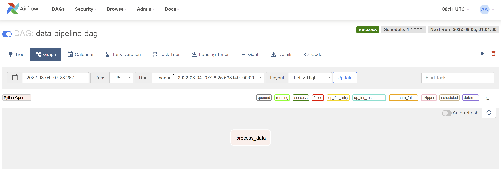

Scheduling at 1.01am everyday:

# Scheduling via Crontab

In my ubuntu terminal, I navigated to the folder where my Data_Pipelines.py was placed

I typed:

```
which python3 
```

to see my where my python3.exe is


Then, I typed:

```
crontab -e
```

Copy pasted this:

```
1 1 * * * /usr/bin/python3  Data_Pipelines.py
```

Then I saved and exited

To check:

```
crontab -l
```

However, I realised that my dataset is still not yet produced in a schedule.

(On the side note, ```Data_Pipelines.py``` file in the ```Section1``` directory was my original file I used to run the cron job as mentioned above.)


# Scheduling Via Airflow

Here's how I attempted to use Airflow to reschedule:

1. Navigate to desired folder 
2. Start docker as follows

```
unset DOCKER_HOST
sudo /etc/init.d/docker start
```

3. Then, I followed the instructions in this website:

https://geekyhumans.com/schedule-python-scripts-with-apache-airflow/#:~:text=Now%20to%20schedule%20Python%20scripts,in%20there%20ending%20with%20a%20.

But, used my own data processing function.

4. Navigate to folder ```dags``` to see both my dag file which is ```data-pipeline-dag.py```. The python script containing the function which is ```Data_Pipelines.py``` is also in the same folder.

So far, here is how it looks like on Airflow:



However, although my scheduling in airflow is successful. I am not able to see where my processed dataset is. I suspect there is something wrong with the directory path that I parsed in.